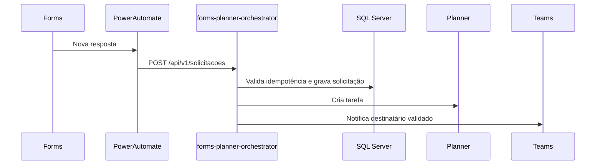

# Fluxo Forms → Planner

```mermaid
sequenceDiagram
    participant Forms
    participant PowerAutomate
    participant API as forms-planner-orchestrator
    participant DB as SQL Server
    participant Planner
    participant Teams
    Forms->>PowerAutomate: Nova resposta
    PowerAutomate->>API: POST /api/v1/solicitacoes
    API->>DB: Valida idempotência e grava solicitação
    API->>Planner: Cria tarefa
    API->>Teams: Notifica destinatário validado
```
