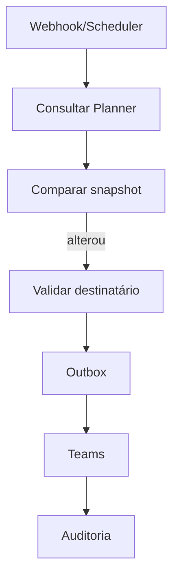

# Fluxo Planner → Teams

```mermaid
flowchart TD
    A[Webhook/Scheduler] --> B[Consultar Planner]
    B --> C[Comparar snapshot]
    C -->|alterou| D[Validar destinatário]
    D --> E[Outbox]
    E --> F[Teams]
    F --> G[Auditoria]
```
