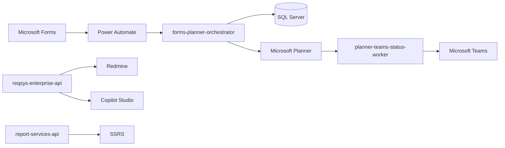

# Arquitetura



## Camadas

```text
web -> application -> domain -> ports -> infrastructure
```

- `web`: controllers, DTOs e exception handlers.
- `application`: casos de uso transacionais.
- `domain`: regras puras, entidades e value objects.
- `ports`: contratos de integração.
- `infrastructure`: JPA, HTTP clients, Graph, Redmine, SSRS e SQL Server.

## Governança

- `X-Correlation-Id` por request.
- `Idempotency-Key` em comandos.
- Outbox para efeitos externos.
- Auditoria de eventos.
- DLQ lógica para falhas não recuperáveis.
- LGPD: mascaramento de CPF, e-mail e telefone.
